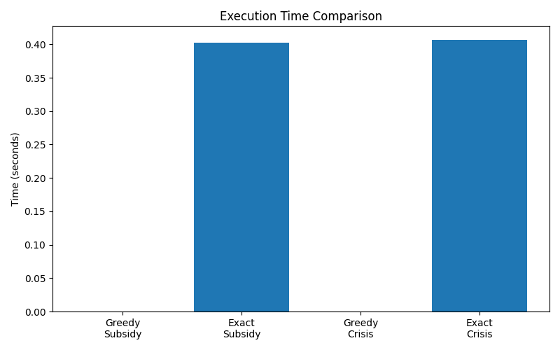
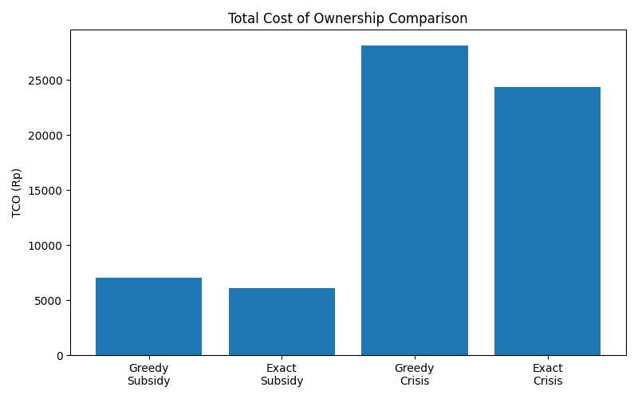

# Optimasi Rute Last Mile Delivery Menggunakan Greedy Nearest Neighbor dan Held-Karp Dynamic Programming


## Deskripsi Proyek

Proyek ini dibuat untuk memenuhi Tugas Besar Praktikum Analisis Algoritma.

Studi kasus yang digunakan adalah optimasi rute **Last Mile Delivery**, yaitu proses menentukan rute pengiriman barang dari gudang (hub) menuju seluruh lokasi pelanggan dan kembali lagi ke hub.

Pada proyek ini dilakukan perbandingan antara dua pendekatan algoritma, yaitu:

- **Algoritma Heuristik:** Greedy Nearest Neighbor (NN)
- **Algoritma Eksak:** Held-Karp Dynamic Programming (DP)

Perbandingan dilakukan berdasarkan dua aspek utama:

- Kinerja algoritma (Execution Time)
- Biaya operasional (Total Cost of Ownership / TCO)

TCO dihitung berdasarkan:

- Fuel Cost (Biaya Bahan Bakar)
- Server Cost (Biaya Komputasi)

Selain itu, program juga mendukung beberapa skenario ekonomi berdasarkan perubahan harga BBM.

---

# Struktur Proyek

```
uas-praktikum-analgo-kel5
│
├── data/
│   ├── locations_dataset.csv
│   ├── distance_matrix_dataset.csv
│   └── scenario.json
│
├── docs/
│   ├── execution_time.png
│   ├── fuel_cost.png
│   └── tco.png
│
├── src/
│   ├── loader.py
│   ├── heuristic.py
│   ├── exact.py
│   ├── cost.py
│   └── main.py
│
└── README.md
```

---

# Cara Menjalankan Program

Pastikan Python telah terinstal pada komputer.

Install library yang diperlukan:

```bash
pip install matplotlib
```

Kemudian jalankan program dengan perintah:

```bash
python src/main.py
```

Program akan secara otomatis:

- Membaca seluruh dataset
- Menjalankan algoritma Greedy Nearest Neighbor
- Menjalankan algoritma Held-Karp Dynamic Programming
- Menghitung Fuel Cost
- Menghitung Server Cost
- Menghitung Total Cost of Ownership (TCO)
- Membuat grafik perbandingan hasil

Seluruh grafik akan disimpan pada folder:

```
docs/
```

---

# Pemilihan Algoritma

## 1. Algoritma Heuristik

### Greedy Nearest Neighbor (NN)

Greedy Nearest Neighbor bekerja dengan memilih lokasi terdekat yang belum dikunjungi pada setiap langkah.

### Kelebihan

- Waktu eksekusi sangat cepat
- Implementasi sederhana
- Cocok untuk data berukuran besar

### Kekurangan

- Tidak menjamin solusi optimal
- Dapat menghasilkan rute yang kurang efisien

---

## 2. Algoritma Eksak

### Held-Karp Dynamic Programming (DP)

Held-Karp merupakan algoritma Dynamic Programming yang digunakan untuk menyelesaikan Traveling Salesman Problem (TSP) secara optimal.

### Kelebihan

- Menjamin rute terbaik (global optimum)
- Menghasilkan total jarak minimum

### Kekurangan

- Membutuhkan waktu komputasi yang lebih besar
- Membutuhkan memori yang lebih banyak

---

# Trade-off Pemilihan Algoritma

Greedy Nearest Neighbor mengutamakan kecepatan komputasi dengan mengorbankan optimalitas solusi.

Sebaliknya, Held-Karp Dynamic Programming mengutamakan pencarian solusi terbaik dengan konsekuensi waktu komputasi yang jauh lebih besar.

Dengan demikian:

- Greedy lebih cocok digunakan pada sistem yang membutuhkan respon cepat dan jumlah lokasi yang banyak.
- Held-Karp lebih cocok digunakan ketika kualitas solusi menjadi prioritas utama.

---

# Analisis Kompleksitas (Big-O)

## Greedy Nearest Neighbor

Algoritma melakukan pencarian node terdekat untuk setiap node yang dikunjungi.

Loop luar:

```
O(n)
```

Loop dalam:

```
O(n)
```

Sehingga kompleksitas waktunya adalah:

```
Time Complexity = O(n²)
```

Kompleksitas ruang:

```
Space Complexity = O(n)
```

karena hanya menyimpan array visited dan route.

---

## Held-Karp Dynamic Programming

Held-Karp membangun seluruh state Dynamic Programming berdasarkan subset node.

Jumlah state:

```
2ⁿ × n
```

Setiap state melakukan transisi sebanyak:

```
n
```

Sehingga:

```
Time Complexity = O(n² × 2ⁿ)
```

Kompleksitas ruang:

```
Space Complexity = O(n × 2ⁿ)
```

Kompleksitas ini menyebabkan Held-Karp kurang cocok digunakan pada jumlah node yang besar.

---

# Hasil Simulasi

Simulasi dilakukan menggunakan dua skenario ekonomi:

1. **Subsidy**
2. **Crisis**

Hasil simulasi menunjukkan bahwa:

- Held-Karp menghasilkan rute yang lebih pendek dibanding Greedy.
- Konsumsi bahan bakar menjadi lebih rendah.
- Biaya komputasi server meningkat karena waktu eksekusi lebih lama.
- Secara keseluruhan nilai TCO algoritma Held-Karp lebih kecil dibanding Greedy.

---

# Analisis Titik Break-Even

Berdasarkan hasil simulasi:

### Skenario Subsidi

- TCO Greedy ≈ Rp 7.036,57
- TCO Held-Karp ≈ Rp 6.098,94

### Skenario Krisis

- TCO Greedy ≈ Rp 28.146,26
- TCO Held-Karp ≈ Rp 24.354,92

Biaya server tambahan yang dibutuhkan Held-Karp relatif sangat kecil dibanding penghematan biaya bahan bakar yang diperoleh dari rute yang lebih optimal.

Dengan model biaya yang digunakan pada proyek ini, **algoritma Held-Karp sudah memberikan keuntungan ekonomi bahkan pada harga BBM Rp5.000/liter**, sehingga tidak diperlukan harga BBM yang lebih tinggi agar algoritma eksak menjadi lebih menguntungkan.

---

# Visualisasi

## Gambar Graf Lokasi

---

## Perbandingan Execution Time


---

## Perbandingan Fuel Cost

---

## Perbandingan Total Cost of Ownership (TCO)

---

# Kesimpulan

Greedy Nearest Neighbor memiliki kompleksitas waktu **O(n²)** sehingga sangat cepat dan cocok digunakan untuk kebutuhan komputasi real-time.

Held-Karp Dynamic Programming memiliki kompleksitas **O(n² × 2ⁿ)** sehingga membutuhkan waktu komputasi lebih besar, namun mampu menghasilkan rute optimal dengan total jarak yang lebih pendek.

Berdasarkan hasil simulasi pada proyek ini, penghematan biaya bahan bakar yang diperoleh dari Held-Karp lebih besar dibanding tambahan biaya komputasi server, sehingga menghasilkan **Total Cost of Ownership (TCO) yang lebih rendah**.

Oleh karena itu, untuk dataset dan model biaya yang digunakan pada proyek ini, **Held-Karp Dynamic Programming menjadi algoritma yang direkomendasikan dari sudut pandang bisnis**, sedangkan **Greedy Nearest Neighbor tetap menjadi pilihan yang baik ketika kecepatan komputasi menjadi prioritas utama**.